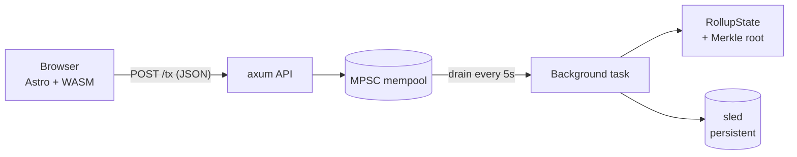

# rust-zkp

A minimal ZK-Rollup, hand-built in Rust. ZKP primitives composed from scratch, wrapped in a real backend with a WASM playground.

🌐 **[Playground](https://egpivo.github.io/rust-zkp/)** · 🚀 **[Live API](https://rust-zkp.onrender.com/health)** · 📚 **[Notes](https://egpivo.github.io/rust-zkp/notes/)**

## What's in it

- **ZKP primitives**: Pedersen commitment · Sigma + Fiat-Shamir · bit-OR (binary Pedersen) · range via bit decomposition · Merkle membership
- **Mini rollup**: signed transactions, atomic batch processing, Merkle state root, sled persistence
- **Production-style backend**: axum, MPSC mempool with background batch builder, structured logging (`tracing`), CORS, custom error responses, full CI/CD
- **WASM playground**: same Rust crypto in the browser; signs and submits to the deployed API

## Architecture



Same Rust ZKP code compiles to both **native** (axum server, sled, CLI) and **wasm32** (loaded by Astro frontend, signs in browser).

## Run locally

```bash
cargo run --bin zkp                                                     # server on :3000
cargo run --bin cli -- send --from 1 --to 2 --amount 30 --nonce 1 --secret 12345
make build-wasm && cd web && npm install && make dev-web                # web playground
cargo test                                                              # 18 passed
make check                                                              # fmt + clippy + test
```

Pre-commit hooks: `pip install pre-commit && pre-commit install`

## Status

Personal learning project. Crypto is intentionally simplified (small primes, no SNARK) — the value is in seeing how every layer composes. Start from [`docs/zk_high_level.md`](docs/zk_high_level.md) (witness → proof → verifier; claims → modules), then [`notes/`](https://egpivo.github.io/rust-zkp/notes/) for each exercise and the backend.
