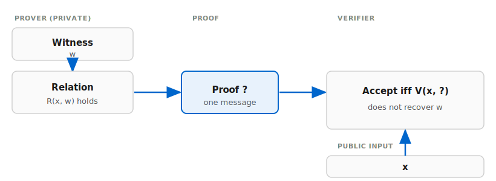

# ZK in this repo (high level)

Two figures you can edit as SVG in **`web/public/diagrams/`** (the site page is `web/src/pages/notes/zk_high_level.astro`).

## 1. Witness → relation → proof → verifier

- **Witness** `w`: secrets only the prover knows.
- **Public** `x`: roots, pubkeys, declared values, etc.
- **Proof** `π`: one message the verifier checks **without** learning `w`.

## 2. Claims in this repo → modules → rollup

Exercises line up loosely: **Ex1** → Sigma, **Ex2** → Pedersen sum, **Ex3** → bits + OR, **Ex4** → Merkle, then the **rollup** composes signatures + state tree.

## 3. Fiat–Shamir

Interactive Sigma is commit → challenge → response. **Fiat–Shamir** sets `e = Hash(transcript)` so the proof is non-interactive. Domain-separated hashing: `transcript.rs` / patterns in `sigma.rs`.

## 4. Strict vs illustrative ZK

| Piece | Role |
|-------|------|
| Sigma + FS, bit-OR | Σ-protocol style NIZK in the ROM (toy group). |
| Basic Merkle open | **Membership**; hiding the leaf needs extra machinery. |
| Rollup demo | System composition; not replacing the primitives above with a SNARK. |

**Blog / site:** [Playground](https://egpivo.github.io/rust-zkp/demos/) · [Notes index](https://egpivo.github.io/rust-zkp/notes/) · on-site note [`/rust-zkp/notes/zk_high_level/`](https://egpivo.github.io/rust-zkp/notes/zk_high_level/).
